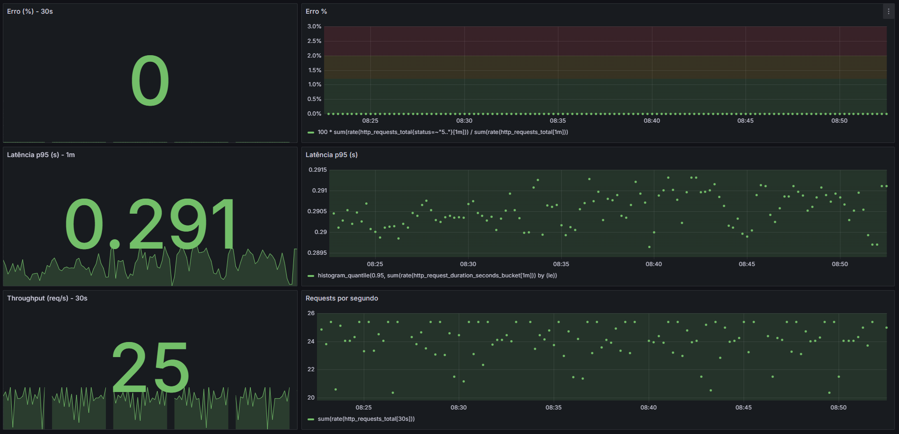
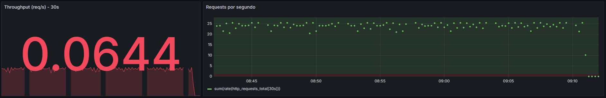
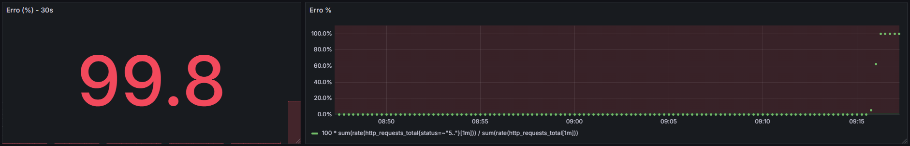
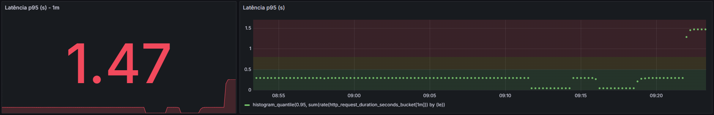

# Observa Kit

[](#) [](#) [](#) [](#) [](#license) [](#)

> Plug-and-play observability starter (Prometheus, Alertmanager, Grafana + FastAPI RED demo). Provisioned dashboards, demo/prod alert rules, and SLO/Runbook templates — ideal for quick pilots and SMB handoffs.

---

## Pre-requirements
- Docker e Docker Compose installed.

## How to run
```bash
docker compose up -d
# Grafana: http://localhost:3000  (admin / admin)
# Prometheus: http://localhost:9090
# App (docs): http://localhost:8000/docs
```

## Test alerts (another terminal)
```bash
# Activate alerts with demo config
make demo

# Activate alerts with prod config
make prod

# Generate requests
while true; do for i in {1..20}; do curl -s http://localhost:8000/checkout >/dev/null & done; wait; sleep 0.5; done

# Simulate 5xx errors for 2 minutes
curl "http://localhost:8000/simulate/error?minutes=2"

# Simulate slowness for 2 minutes
curl "http://localhost:8000/simulate/slow?minutes=2"
```

## What’s included
- FastAPI app with Prometheus metrics and incident simulation.
- Prometheus with alert rules (error%, p95, throughput).
- Alertmanager sending webhooks to the app itself (/alerts).
- Grafana provisioned with a datasource and the “Observa – Service Health” dashboard.
- Templates: Runbook, SLO, One-pager, Proposal/SOW, NDA, Acceptance checklist.

## Next steps
- Adjust thresholds (e.g., p95 800 ms → your reality).
- Replace the demo app with the client’s endpoints (Micrometer/prom-client/etc.).
- (Optional) Add exporters (postgres_exporter, node_exporter, etc.).

---

## Screenshots

**Dashboard – Health (RED)**


**Low throughput issue**


**High error rate issue**


**High latency issue**

